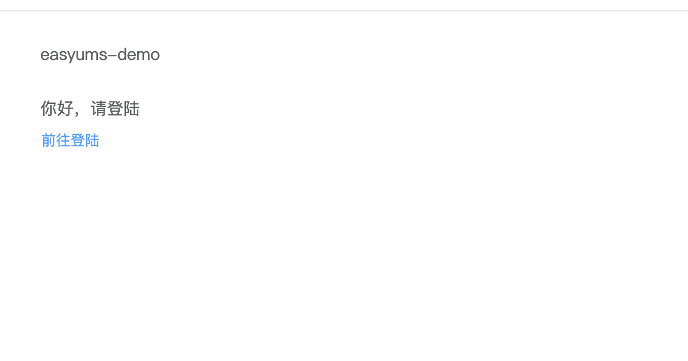
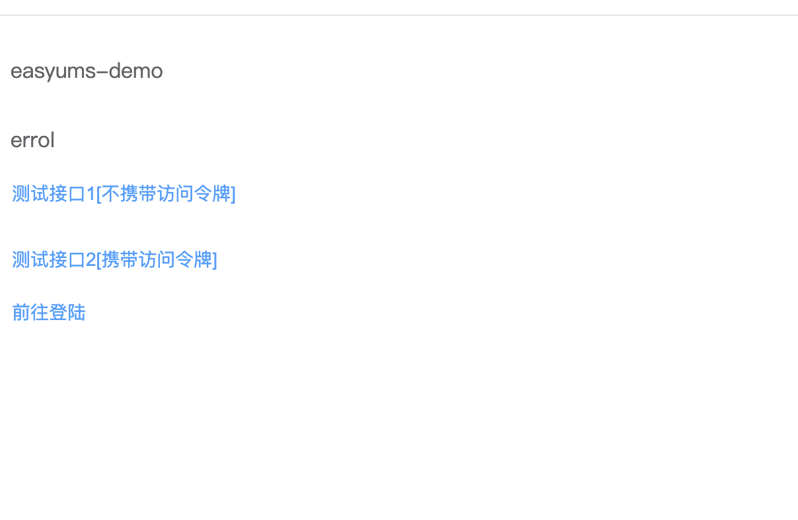

# EASYUMS-DEMO

easyums授权系统对接示例。

## 启动

### 一、启动easyums

如有疑惑，请先查看[easyums](https://github.com/xxzhiwei/easyums)的项目说明。

> https://github.com/xxzhiwei/easyums

### 二、启动easyums-demo

本系统又分为前后端两个部分。

#### 1、web

web端主要包含了三个页面，分别为登陆、注册、home。



*图1 主页（未登录）*



*图2 主页（已登录）*

在当前，使用该网页的目的是为了成功调用home页面中的"/test/1"接口，如下所示：


*图3 测试接口2*

点击该按钮，并得到"ok"的提示字样时，表示调用成功。

当然，对于首次使用系统的用户来说，在成功调用接口之前，还需要经过一系列的步骤。

该流程可以简单概括为：

> easyums-demo -> 跳转 -> easyums -> 认证(按需注册) -> 跳转 -> easyums-demo -> (按需注册) -> 授权登录成功

在上述的流程中，对于首次使用系统的用户来说，需要分别在easyums和easyums-demo系统中注册账号，即除了oauth授权服务器之外，第三方应用也有自己的用户体系，而不是赖于授权服务器。

> 第三方应用只是从授权服务器中获取了用户的数据，并为用户在自己的系统上注册了一个账号，该账号与授权服务器的账号关联。

oauth的统一登陆（或者也可以说是单点登录）就是靠这个关联关系实现的。

1）配置客户端与授权服务器信息

> web/src/views/login.vue

```js
// 授权地址
const HOST = "http://localhost:8084/oauth2/authorize";
// 客户端id
const CLIENT_ID = 2;
// 客户端回调
const REDIRECT_URI = "http://localhost:8887/#/oauth2/callback";
// 权限范围
const SCOPE = "openid profile email";
```

2）执行启动命令

```bash
cd web

# 安装依赖；已安装可跳过
npm i

npm run dev
```

#### 3、server

1）创建数据库，并执行sql语句。

> server/demo1.sql

数据库名可与sql文件同名；自定义时，配置文件中的数据库信息需要同步修改。

2）修改配置文件

> server/app.ini

其中web和server中的客户端信息必须保持一致，否则会导致授权失败；另外rsa_public_key由easyums中的js脚本生成后拷贝给客户端server，详情查看[easyums文档](https://github.com/xxzhiwei/easyums)。

```ini
[server]
port=8088

# mysql配置
[database]
host=localhost
port=3306
user=root
password=
db_name=demo1

# oauth客户端配置
[oauth.client]
id=2
secret=easyums@demo1
redirect_uri=http://localhost:8887/#/oauth2/callback

# oauth授权服务器配置
[oauth.server]
# 主机地址
host=http://127.0.0.1:8084

# jwt配置
[jwt]
# 公钥路径
rsa_public_key=/your/path/rsa_public_key.pem
```

3）执行启动命令

```bash
cd server

npm i

# 赋予权限
chmod u+x bin/www

bin/www
```

### 三、在浏览器打开以下地址

> http://localhost:8887