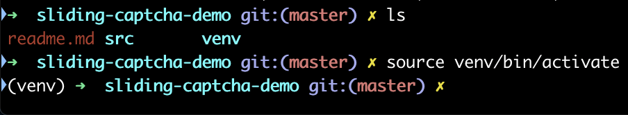

# sliding-captcha-demo

本项目为处理滑动认证码的案例。

项目依赖于Pillow、opencv-python两个库，其中后者比较难安装，最好是创建虚拟环境来运行该项目。

## 创建虚拟环境的方法

1、使用pip安装virtualenv；未安装pip请自行安装

> pip install virtualenv

2、创建虚拟环境

切换到项目根目录后，在终端执行以下命令

> virtualenv venv

3、激活虚拟环境

1）windows

> .\venv\Scripts\activate

2）macos

> source venv/bin/activate

在终端显示"venv"字样表示成功进入虚拟环境

4、安装依赖

> pip install Pillow opencv-python

*当然，其实在pycharm中就不用那么麻烦*