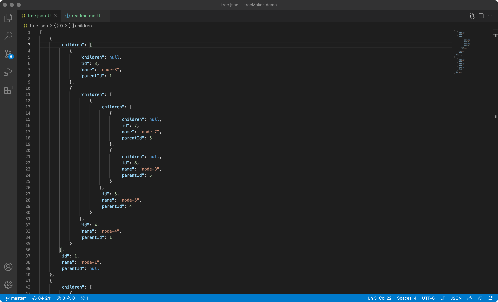

# TreeMaker-demo

一个由java编写、用于生成树形结构数据的实用小工具，不仅使用简单，还很通用，可以有效消除重复的模板代码，使得项目更加清爽简洁易于维护。

## 编译源文件
以下命令在终端操作，其中需要额外注意的是，"-classpath"后面的参数是"点"和"冒号"。

```base
javac -classpath .:lib/fastjson-1.2.33.jar -d output src/com/treemaker/demo/*.java
```

## 执行class
与编译源文件有所区别的是，在执行class文件的时候，需要把盘符切换到class文件的上一级目录，否则会报"找不到或无法加载主类"的错误。

```base
# 如果没有这个目录就先创建
cd output/

java -classpath .:../lib/fastjson-1.2.33.jar com.treemaker.demo.Test
```
> 如果在集成环境中，也可以直接运行com.treemaker.demo.main方法，效果是一样的。

## 查看执行结果

正确执行完上述的命令后，项目根目录中将会生成两个json文件（tree.json和category-tree.json），方法执行的结果就保存在里面。

如：

